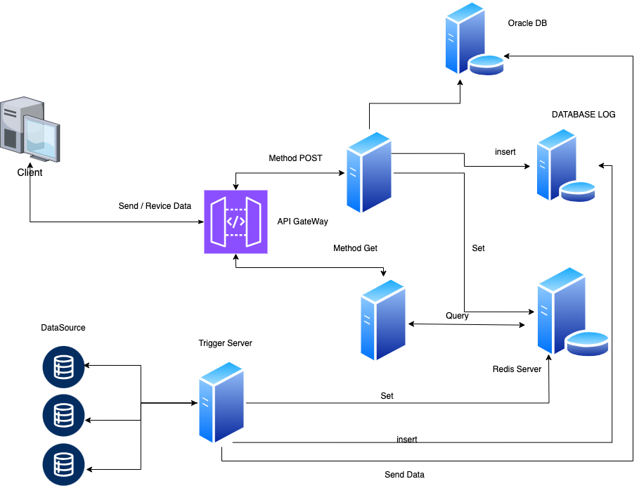

# Problem 3: Design oracle system

# Design Oracle
**I design follow  Clean Code Architecture**
###  Overview
1.  **Entities**: Core business logic and objects
2.  **Use Cases**: Application-specific business rules
3.  **Interface Adapters**: Converters that adapt data from the UI, external APIs, or other sources

###  Stack
1.  **Redis**: TTL: Cache key design key ["datasource-symbol"]
2.  **MongoDB**:  Log Data
3.  **GO**: 

# Client Query and EndPoint
All API requests require Header **Authorization**
#### Endpoint: `/api/v1/price`
 -   **Method**: GET
 -   **Query Parameters**:
    -   `currency_pair` (required): The currency pair for which the price is requested (e.g., `BTC/USD`).

**Example Request**:
`GET /api/v1/price?currency=BTC/USD` 

**Example Response**:
```
{
  "currency_pair": "BTC/USD",
  "price": 34000.00,
  "timestamp": 1628073600
  "source" : "coinMarketCap"
},
{
  "currency_pair": "BTC/USD",
  "price": 34000.00,
  "timestamp": 1628073500
  "source" : "Binance"
},
```
`GET /api/v1/price?currency=BTC/USD&source=binance` 

**Example Response**:
```
{
  "currency_pair": "BTC/USD",
  "price": 34000.00,
  "timestamp": 1628073500
  "source" : "Binance"
}
```
#### Endpoint: `/api/v1/price`
 -   **Method**: POST
**Example Request**:
`POST /api/v1/price` 
```
{
  "currency_pair": "BTC/USD",
  "price": 34000.00,
  "source" : "coinMarketCap",
  "uid" : "acvvbbb" // userid-uuid 
}
```
**Example Response**:
```
{
  "status": "Sucess",
  "currency_pair": "BTC/USD",
  "price": 34000.00,
  "timestamp": 1628073600
  "source" : "coinMarketCap"
}
```

**Process System**
 - Set Trigger Fetch Data currency every  5 second 
	 -  CoinMarketCap
	 -  CoinGecko
 -  Recive Data send to Logic Compair Old Data exchange if Data Change Set value to Redis Key
 - Send Data to DBLog(MongoDB,MySQL,RedisSearch)
 
 
 

# Challenges 
 - Source Reliability
 - Client-Side Variability
 - Security
 - RealTime Data

# Handing Solutions
**Security Measures**:

-   **Secure Communication**: Use HTTPS and other encryption methods to secure data transmission.
-   **Authentication**: Implement  authentication mechanisms such as API keys, or JWT to ensure only authorized clients can interact with the system.
-   **Rate Limiting and Throttling**: Protect the system rate limiting and throttling for both data submission and querying.

**Realtime**:

 -  **Cache Data**
 -  **Rate Limiting and Throttling**: Protect the system rate limiting and throttling for querying.

**Soure Reliablity**

 - **Alerts and Notifications** : DataSource Downtime and unavailable

 **Data Validation and Normalization**

 
 **Data High Availability**
    -  **DataBase Replication**
    -  **Redis Replication**

 


